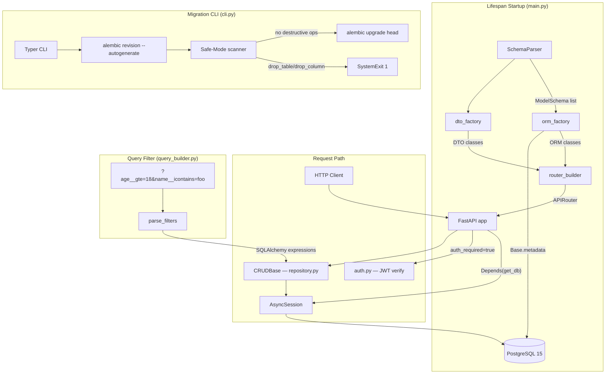

# CoreNexus Design Document

---
document_type: DesignDocument
version: 1.1.0
status: active
author_agents: [PM, SA, CodeReviewer, Orchestrator]
date: 2026-05-08
last_updated: 2026-05-08
project: CoreNexus
sprint: 1
sprint_1_status: COMPLETE
---

---

## 1. Executive Summary

CoreNexus is a **Meta-System Code Generation Engine** that implements a Single Source of Truth (SSOT) architecture for REST API services. Rather than hand-writing boilerplate, engineers define data models as YAML blueprints; the system then auto-generates the full stack at startup — SQLAlchemy ORM models, Pydantic V2 DTOs, FastAPI CRUD routers, and Alembic migration scripts.

**Current State (as of 2026-05-08)**

All five implementation phases are functionally complete and confirmed through source inspection:
- Phase 1–4 code exists and is non-trivial
- 24 example YAML blueprints exist under `blueprints/`
- Dockerfile and docker-compose.yml are present
- `requirements.txt` pins all production and dev dependencies

The codebase is production-*shaped* but not production-*hardened*. Three distinct risk categories exist: a critical secret-management gap, several high-priority correctness issues that will surface under real usage, and a cluster of medium/low issues that affect long-term maintainability and operational readiness.

---

## 2. System Architecture (SA Perspective)

### 2.1 Data Flow

```
blueprints/*.yaml
    │
    ▼
SchemaParser.load_all()                      [parser.py]
    │  yaml.safe_load → ModelSchema.model_validate()
    │  Fail-Fast: SystemExit on parse or validation error
    ▼
build_all_orm_models(schemas, Base)          [orm_factory.py]
    │  type() metaclass → SQLAlchemy DeclarativeBase subclass
    │  _build_sa_column(): FieldType → mapped_column()
    │  relationship() for RelationSchema entries
    ▼
Base.metadata.create_all(conn)              [main.py lifespan]
    │  Idempotent table creation (Alembic handles real migrations)
    ▼
build_all_dtos(schemas)                      [dto_factory.py]
    │  pydantic.create_model → {Create, Update, Response}DTO
    │  Response DTO: from_attributes=True for ORM serialization
    ▼
create_crud_router(schema, orm, crud, dtos) [router_builder.py]
    │  APIRouter with prefix=/{table_name}
    │  POST / GET / GET/{id} / PUT/{id} / DELETE/{id}
    │  auth_required → Depends(verify_token) injected
    ▼
app.include_router(router, prefix="/api/v1") [main.py]
    │
    ▼
FastAPI app serving on /api/v1/{table_name}/...
```

### 2.2 Component Diagram



### 2.3 Key Modules

| Module | Responsibility | Notable Pattern |
|---|---|---|
| `schema_def.py` | Meta-schema (Pydantic V2) | FieldType enum with `_missing_` for clear errors |
| `orm_factory.py` | Dynamic ORM class generation | `type()` metaclass; `_class_registry` cache check |
| `dto_factory.py` | Dynamic Pydantic DTO generation | `create_model`; three-DTO pattern (Create/Update/Response) |
| `parser.py` | YAML blueprint loading | `yaml.safe_load`; Fail-Fast via `SystemExit` |
| `repository.py` | Generic async CRUD | Generic `CRUDBase[M, C, U]`; generic PK via `sa_inspect` ✅ |
| `router_builder.py` | Dynamic FastAPI router | Closure factories for POST/PUT/PATCH handlers ✅ |
| `query_builder.py` | Magic filter protocol | Django-style `__gte`/`__icontains` operators |
| `auth.py` | JWT issue + verify | python-jose + bcrypt; SECRET_KEY from env var ✅ |
| `database.py` | Async engine + session | `create_async_engine` with pool tuning |
| `main.py` | App + lifespan + auth endpoints | `_RegDTO` inline model; `app.state` for ORM |
| `cli.py` | Migration CLI | Typer; regex-based Safe-Mode scan |
| `alembic/env.py` | Dynamic metadata for migrations | Imports ORM factories at module load time |

---

## 3. Current Implementation Status

### 3.1 What Is Complete

| Component | Status | Notes |
|---|---|---|
| Meta-schema (`schema_def.py`) | Complete | `FieldType`, `RelationType`, `FieldSchema`, `RelationSchema`, `ModelSchema` |
| ORM factory | Complete | All 8 field types mapped; FK + relationship support |
| DTO factory | Complete | 3-DTO pattern with OpenAPI `examples`; `from_attributes` on Response |
| YAML parser | Complete | Fail-Fast on missing dir, missing files, parse errors, validation errors, duplicates |
| Generic repository | Complete | `get`, `get_multi` (with filters/ordering), `create`, `update`, `remove` |
| Router builder | Complete | Full CRUD; `PaginatedResponse`; `auth_required` support |
| Magic filter protocol | Complete | 12 operators including `icontains`, `in`, `isnull` |
| JWT auth | Functional | Issue + verify + bcrypt; missing env-var injection |
| Alembic integration | Complete | Dynamic metadata in `env.py`; async engine for online migrations |
| Migration CLI | Complete | Typer; `makemigrations`, `migrate`, `downgrade`, `status`; Safe-Mode |
| Docker | Complete | `Dockerfile` + `docker-compose.yml` exist |
| Example blueprints | Complete | 24 YAML blueprints covering diverse domains |
| Unit tests (Phase 1) | Present | `tests/test_phase1.py` uses YAML fixtures |
| Integration tests (Phase 2–5) | Present | Files exist; content depth not fully inspected |

### 3.2 What Is Missing or Incomplete

| Gap | Severity | Status | Details |
|---|---|---|---|
| `SECRET_KEY` from environment | Critical | ✅ Fixed (Sprint 1) | Loaded via `os.getenv`; `ValueError` on missing |
| PATCH endpoint | High | ✅ Fixed (Sprint 1) | `PATCH /{id}` added to all generated routers |
| `datetime.utcnow()` usage | High | ✅ Fixed (Sprint 1) | Replaced with `datetime.now(timezone.utc)` |
| Generic PK lookup in repository | High | ✅ Fixed (Sprint 1) | `sa_inspect` used; no longer assumes column named `id` |
| YAML/JSON docs mismatch | High | ✅ Fixed (Sprint 1) | CLAUDE.md + README updated to say YAML |
| CORS configuration | Medium | ⏳ Sprint 2 | No `CORSMiddleware` in `main.py` |
| Error response format | Medium | ⏳ Sprint 2 | `IntegrityError` handler uses non-standard shape |
| Rate limiting | Low | ⏳ Sprint 3 | No middleware or decorator present |
| Refresh token | Low | ⏳ Sprint 3 | Access-only token issuance; no rotation |

---

## 4. Identified Issues & Improvement Areas

### 4.1 Critical (Security) — ✅ All resolved in Sprint 1

#### CRIT-1 — Hardcoded JWT Secret Key — ✅ Resolved in Sprint 1
**Location:** `src/core/auth.py`
**Was:** `SECRET_KEY = "super-secret-meta-system-key"` (hardcoded string literal)
**Risk:** Anyone with repository access (including git history) can forge valid JWT tokens for any user, completely bypassing authentication.
**Fix applied:** `_load_secret_key()` reads from `os.getenv("SECRET_KEY")`; raises `ValueError` at module import time if unset. See `.env.example` for setup instructions and ADR-001.

#### CRIT-2 — `exec()` for Route Handler Registration — ✅ Resolved in Sprint 1
**Location:** `src/core/router_builder.py`
**Was:** Two `exec()` blocks used to define POST and PUT handlers with correct type annotations.
**Risk:** Difficult to audit; breaks debugger step-through; produces anonymous stack frames in tracebacks; maintenance hazard if user-influenced data ever reached the f-string template.
**Fix applied:** Replaced with `_make_create_handler()`, `_make_update_handler()`, and `_make_patch_handler()` closure factories that mutate `__annotations__["item"]` after definition. See ADR-003.

---

### 4.2 High (Correctness / API Design) — ✅ All resolved in Sprint 1

#### HIGH-1 — Hardcoded `.id` Primary Key in Repository — ✅ Resolved in Sprint 1
**Location:** `src/core/repository.py`
**Was:** `self.model.id == id_val` — assumes every model has a column named `id`.
**Risk:** Any blueprint naming its PK something other than `id` (e.g., `code`, `pk`) produces `AttributeError` at runtime.
**Fix applied:** `CRUDBase.__init__` now uses `sa_inspect(model).mapper.primary_key` to resolve the actual PK column and stores `self._pk_attr` + `self._pk_is_uuid`. Raises `ValueError` on composite PKs. See ADR-004.

#### HIGH-2 — No PATCH Endpoint — ✅ Resolved in Sprint 1
**Location:** `src/core/router_builder.py`
**Was:** Only `PUT /{id}` existed; partial updates required sending the full resource.
**Risk:** Nullable fields not included in the PUT payload are overwritten with `None`.
**Fix applied:** `PATCH /{id}` added via `_make_patch_handler()`. Uses the same all-optional `UpdateDTO` and `crud.update()` with `exclude_unset=True`, giving correct partial-update semantics automatically.

#### HIGH-3 — `datetime.utcnow()` Deprecated — ✅ Resolved in Sprint 1
**Location:** `src/core/auth.py`
**Was:** `datetime.utcnow()` called on every token issuance.
**Risk:** `DeprecationWarning` in Python 3.12; `utcnow()` removed in Python 3.14.
**Fix applied:** Replaced with `datetime.now(timezone.utc)` throughout `auth.py`.

#### HIGH-4 — Blueprint Format Mismatch (Docs vs. Code) — ✅ Resolved in Sprint 1
**Locations:** `CLAUDE.md`, `README.md`
**Was:** Documentation said "JSON Schema Blueprints"; parser actually reads `.yaml` files.
**Risk:** Contributors create `.json` files that are silently ignored, causing a confusing startup error.
**Fix applied:** All documentation updated to say "YAML blueprints". See ADR-002.

---

### 4.3 Medium (Architecture / Maintainability) — ⏳ Targeted in Sprint 2

#### MED-1 — Non-Standard Error Response Shape — ⏳ Sprint 2
**Location:** `src/main.py:80-83`
```python
content={"error": "Resource Conflict", "detail": "A unique constraint..."}
```
**Risk:** The project's own constitution (`CLAUDE.md` Section 12) mandates:
```json
{"success": false, "error": {"code": "ERR_...", "message": "..."}, "meta": {...}}
```
The `404` responses from `router_builder.py` also use FastAPI's default `{"detail": "..."}` shape. Clients parsing error responses need to handle two distinct schemas.
**Fix:** Add a custom `HTTPException` handler and a standardized error factory function. Wrap all `raise HTTPException(...)` calls to emit `ERR_{DOMAIN}_{REASON}` codes.

#### MED-2 — `_RegDTO` Inline Pydantic Model — ⏳ Sprint 2
**Location:** `src/main.py:105-113`
```python
@app.post("/api/v1/auth/register", ...)
async def register(body: RegisterRequest, db=Depends(get_db)):
    class _RegDTO(BaseModel):
        email: str
        hashed_password: str
        full_name: str | None = None
    dto = _RegDTO(...)
```
**Risk:** A Pydantic model defined inside a request handler is re-created on every request (minor perf), is invisible to OpenAPI schema generation, and cannot be reused by tests or other handlers.
**Fix:** Extract `_RegDTO` to a module-level class, or — better — pass the data dict directly to `user_crud.create()` since `CRUDBase.create()` already handles plain dicts via `hasattr(obj_in, "model_dump")`.

#### MED-3 — Untyped `app.state` Access — ⏳ Sprint 2
**Location:** `src/main.py:58-60, 99, 103, 121`
```python
app.state.user_orm = orm_models["User"]
app.state.user_crud = CRUDBase(orm_models["User"])
...
user_crud = getattr(app.state, "user_crud", None)
```
**Risk:** Typo-prone; no IDE autocomplete; silent `None` if the `User` blueprint does not exist. The `503` response is correct behavior, but the check pattern is repeated and fragile.
**Fix:** Use a typed `AppState` Pydantic model or typed `dataclass` and assign it to `app.state` in lifespan. Alternatively, use `request.app.state` with explicit Optional typing via a `TypedDict`.

#### MED-4 — `Base.registry._class_registry` Private API Access — ⏳ Sprint 2
**Location:** `src/core/orm_factory.py:72`
```python
existing = Base.registry._class_registry.get(schema.model_name)
```
**Risk:** `_class_registry` is a private, undocumented attribute on SQLAlchemy's `RegistryManager`. It has changed between minor versions (it was `_class_registry` in 2.0, but the access path may shift). A SQLAlchemy minor upgrade could silently return `None` and cause duplicate table definition errors.
**Fix:** Catch `sqlalchemy.exc.InvalidRequestError` (raised when attempting to redefine a mapped class) or maintain an explicit `dict[str, type]` cache at the factory level.

---

### 4.4 Low (Production Readiness) — ⏳ Targeted in Sprint 3

#### LOW-1 — No CORS Configuration — ⏳ Sprint 3
**Location:** `src/main.py` — absence
**Risk:** Cross-origin requests will be blocked by browsers by default (no `Access-Control-Allow-Origin` header). For any browser-based frontend, this is a total blocker.
**Fix:** Add `CORSMiddleware` with an explicit allowlist from environment variable. Default to `["http://localhost:3000"]` in development.

#### LOW-2 — No Rate Limiting — ⏳ Sprint 3
**Risk:** Public endpoints (`/api/v1/auth/token`, `/api/v1/auth/register`) are open to credential stuffing and brute force. `CLAUDE.md` Section 11 mandates 100 req/min/IP.
**Fix:** Add `slowapi` (built on `limits`) or a reverse-proxy-level rule (nginx `limit_req`). Document the chosen approach.

#### LOW-3 — No Refresh Token — ⏳ Sprint 3
**Location:** `src/core/auth.py`, `src/main.py` — absence
**Risk:** Access tokens expire after 30 minutes and users must re-authenticate. `CLAUDE.md` Section 11 requires Refresh Token Rotation.
**Fix:** Add a `POST /api/v1/auth/refresh` endpoint. Store refresh tokens in a dedicated table (or Redis) with single-use enforcement.

#### LOW-4 — No `requirements-dev.txt` Separation — ⏳ Sprint 3
**Location:** `requirements.txt:15-19`
**Risk:** `pytest`, `httpx`, and `python-multipart` are bundled with production dependencies. Docker builds for production install test tooling unnecessarily.
**Fix:** Split into `requirements.txt` (prod) and `requirements-dev.txt` (test/lint). Update Dockerfile to use only prod deps.

---

## 5. Architectural Decisions Required

The following ADRs have been created under `.claude/.decisions/`:

| ADR | Topic | Status |
|---|---|---|
| ADR-001 | Secret management — env var vs. hardcoded | ✅ Accepted & Implemented |
| ADR-002 | Blueprint format — YAML vs. JSON | ✅ Accepted & Implemented |
| ADR-003 | Dynamic routing — `exec()` vs. closure factory | ✅ Accepted & Implemented |
| ADR-004 | Primary key abstraction — hardcoded `.id` vs. generic PK lookup | ✅ Accepted & Implemented |

---

## 6. Proposed Improvements (Concrete Recommendations)

### 6.1 Fix CRIT-1: Secret Key from Environment — ✅ Implemented in Sprint 1

`src/core/auth.py` now exposes `_load_secret_key()` which reads `os.getenv("SECRET_KEY")` and raises `ValueError` at module import time if the value is absent or empty. The server refuses to start rather than running in an insecure state. See `.env.example` for setup instructions.

### 6.2 Fix CRIT-2: Replace `exec()` with Closure Factory — ✅ Implemented in Sprint 1

`src/core/router_builder.py` now uses `_make_create_handler()`, `_make_update_handler()`, and `_make_patch_handler()` closure factories. Each defines an `async def` and then mutates `__annotations__["item"]` to inject the runtime-generated DTO type, giving FastAPI the correct annotation without `exec()`.

### 6.3 Fix HIGH-1: Generic PK Lookup — ✅ Implemented in Sprint 1

`CRUDBase.__init__` now calls `sa_inspect(model).mapper.primary_key` to resolve the actual PK column at construction time, storing `self._pk_col`, `self._pk_attr`, and `self._pk_is_uuid`. UUID coercion in `get()` is type-driven (checks `SAUuid`/`PGUUID`) rather than relying on the length-36 string heuristic.

### 6.4 Fix HIGH-2: Add PATCH Endpoint — ✅ Implemented in Sprint 1

`create_crud_router()` now registers `PATCH /{id}` via `_make_patch_handler()`. Because `UpdateDTO` already marks every field `Optional` with `default=None`, and `CRUDBase.update()` uses `exclude_unset=True`, PATCH semantics are correct automatically — only fields present in the request body are updated.

### 6.5 Fix HIGH-3: Timezone-Aware Datetimes — ✅ Implemented in Sprint 1

Both `datetime.utcnow()` calls in `src/core/auth.py` replaced with `datetime.now(timezone.utc)`. Import updated to `from datetime import datetime, timedelta, timezone`.

### 6.6 Fix MED-1: Standardized Error Response — ⏳ Sprint 2

```python
# src/core/errors.py  (new module)
from fastapi import Request
from fastapi.responses import JSONResponse
from datetime import datetime, timezone
import uuid

def error_response(status_code: int, code: str, message: str, detail: str | None = None):
    return JSONResponse(
        status_code=status_code,
        content={
            "success": False,
            "error": {"code": code, "message": message, "detail": detail},
            "meta": {
                "request_id": str(uuid.uuid4()),
                "timestamp": datetime.now(timezone.utc).isoformat(),
                "api_version": "0.1.0",
            },
        },
    )
```

Register a global `HTTPException` handler in `main.py` that converts `detail` strings to this format.

### 6.7 Fix MED-4: Private API Cache Replacement — ⏳ Sprint 2

```python
# src/core/factory/orm_factory.py
_MODEL_CACHE: dict[str, type] = {}

def create_orm_model(schema: ModelSchema, Base: type[DeclarativeBase]) -> type:
    if schema.model_name in _MODEL_CACHE:
        return _MODEL_CACHE[schema.model_name]
    ...
    model_cls = type(schema.model_name, (Base,), attrs)
    _MODEL_CACHE[schema.model_name] = model_cls
    return model_cls
```

---

## 7. Sprint Plan Summary

**Sprint 1 (2026-05-08)** — ✅ COMPLETE — targeted all CRITICAL and HIGH issues:

| Priority | Task | File | Issue | Status |
|---|---|---|---|---|
| P0 | Load SECRET_KEY from env | `auth.py` | CRIT-1 | ✅ Done |
| P0 | Replace `exec()` with closure factory | `router_builder.py` | CRIT-2 | ✅ Done |
| P1 | Generic PK resolution in CRUDBase | `repository.py` | HIGH-1 | ✅ Done |
| P1 | Add PATCH endpoint | `router_builder.py` | HIGH-2 | ✅ Done |
| P1 | Fix `datetime.utcnow()` | `auth.py` | HIGH-3 | ✅ Done |
| P1 | Update docs to say YAML (not JSON) | `CLAUDE.md`, `README.md` | HIGH-4 | ✅ Done |

**Sprint 2** targets MEDIUM issues:
- Standardized error response format (MED-1)
- Extract `_RegDTO` and unify auth endpoint style (MED-2)
- Typed `app.state` via `pydantic-settings` (MED-3)
- Replace `_class_registry` access with explicit cache (MED-4)

**Sprint 3** targets LOW issues:
- CORS middleware with env-var allowlist (LOW-1)
- Rate limiting via `slowapi` (LOW-2)
- Refresh token with rotation (LOW-3)
- Split `requirements.txt` / `requirements-dev.txt` (LOW-4)

See `.claude/sprint/current/plan.md` for the full Sprint 1 task table with acceptance criteria.
