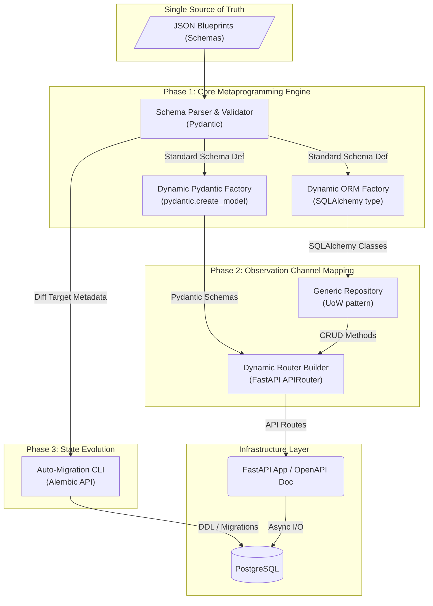

# Meta-System 生成引擎：系統架構與願景 (System Architecture & Vision)

## 1. 系統願景與核心定位 (System Vision)

從系統工程的最高維度來看，本專案並非為特定業務邏輯開發的「應用程式 (Application)」，而是作為應用程式基礎設施的「生成引擎 (Meta-System)」。
其核心精神遵循 **「單一事實來源 (Single Source of Truth, SSOT)」**：開發者只需維護一份低維度的靜態結構描述（JSON Blueprints），引擎即可在記憶體中自動映射並推導出所有高維度執行期實體，包含：
1. 資料庫結構與模型 (ORM Model)
2. 傳輸物件模型與驗證邏輯 (DTO / Validation)
3. 業務操作邏輯 (CRUD Repository)
4. 路由端點與文檔介面 (API Endpoints & Swagger)
5. 資料庫演進腳本 (Migrations)

這種「Data-Driven API」或「Meta-Driven Development」的架構，能夠消除 80% 以上的重複性 Boilerplate Code，使開發團隊將精力專注於「抽象設計」與「特殊業務擴展」。

## 2. 架構原則 (Architectural Principles)

* **宣告式優於指令式 (Declarative over Imperative)**：業務邏輯與架構由宣告式的 JSON 定義，而非手寫綁定程式碼。
* **高內聚低耦合 (High Cohesion, Loose Coupling)**：各生成器（ORM Factory、DTO Factory、Router Factory）職責分離，僅依賴於 Schema Validator 輸出的標準結構。
* **防禦性設計 (Defensive Design)**：在啟動階段 (Lifespan/Startup) 進行嚴格的 Schema 校驗，確保任何不合規的 Blueprint 會在啟動期（Fail-Fast）中斷，不會污染線上運行狀態。
* **平滑過渡能力 (Smooth Evolution)**：Schema 的變更必須對等映射到關聯式資料庫的 Migration，並將資料破壞風險最小化（Safe-Mode 攔截）。

## 3. 系統巨觀架構 (Macro Architecture)

## 4. 技術選型準則 (Technology Stack Criteria)

| 領域 | 技術選型 | 選擇理由 (Architectural Decision) |
|---|---|---|
| 核心框架 | FastAPI | 原生提供 ASGI，對 Pydantic 與 OpenAPI (Swagger) 極度友好，非常適合動態建立路由。 |
| 資料庫處理 | SQLAlchemy 2.0 (Async) | 提供頂級的 Python ORM 操作能力與類型支持，DeclarativeBase 適合使用 Metaclass 動態繼承。 |
| 資料傳輸物件 | Pydantic V2 | 效能優越(Rust Core)，並提供 `create_model` 用於動態類別產生，無縫對接 FastAPI。 |
| 型別/腳本遷移 | Alembic | 直接與 SQLAlchemy 的 MetaData 整合，允許透過比較動態生成的記憶體模型與 DB 來做 Autogenerate。 |
| RDBMS | PostgreSQL 15+ | 支援齊全的 JSONB 與強型別，搭配 asyncpg 連線驅動可達極高吞吐。 |

## 5. 開發演進策略 (Evolution Strategy)

本系統開發將被嚴格分割為五個漸進階段：
- **Phase 1**: 穩定事實層與記憶體映射（不插電 DB，重點驗證 Model 生成機制）。
- **Phase 2**: 打通對外通訊（驗證 API Explorer 是否能正確解析動態模型）。
- **Phase 3**: 攻克物理結構障礙（設計無痛擴展與修改的 DB Migration 腳本）。
- **Phase 4**: 賦予應用級能力（查詢、鑑權、分頁，從原型邁入實用）。
- **Phase 5**: 進入企業級戰備（異步連線池、全局例外攔截、容器化封裝）。
